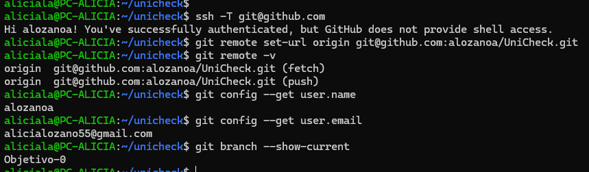

# GestionAmigos

## Descripción del Problema

Un amigo siempre que quiere quedar con un grupo de amigos tarda muchisimo tiempo en poder organizarse con ellos, ya que todos suelen estar bastante ocupados y siempre que proponen un dia hay alguien de su grupo que no puede asistir. Y es un más costoso poder organizar un viaje de varios dias solamente intentando hablarlo por mensaje.

## Funcionamiento previsto

La aplicación web se encarga de generar un calendario para un grupo de usuarios, donde se almacenará los datos que introduzcan los usuarios de ese grupo y pudiendo así filtrar los días donde nadie a introducido ningun dato, es decir, nadie está ocupado esos días. 

## Juego de Rol

## Configuración 

