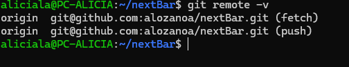

# nextBar

## Descripción del Problema

El cliente, un trabajador con muy poco tiempo, quiere encontrar bares cerca de el que no estén muy concurridos y que no tengan muy mala nota para poder comer rápido y no perder el tiempo.

## Funcionamiento previsto

La aplicación se encarga de analizar y ordenar los datos que extrae de una web para que el cliente pueda enocntrar las mejores opciones. 

## Juego de rol

## Configuración 

